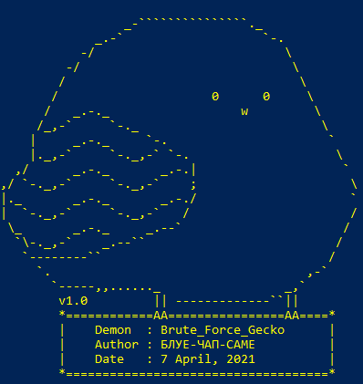
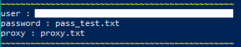
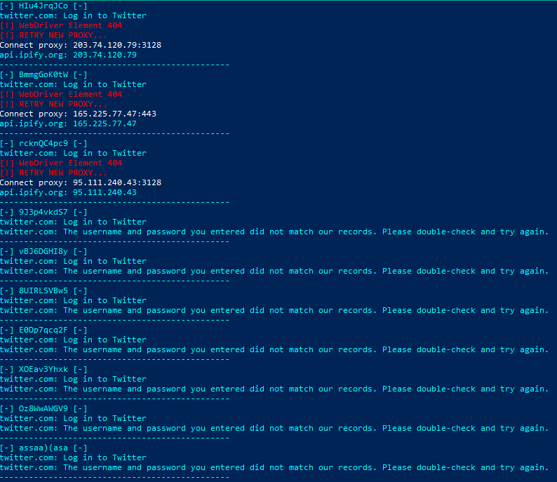
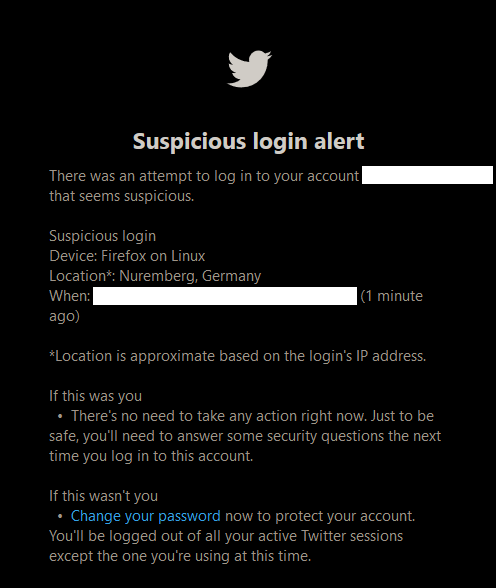

> :warning: **Legal Disclaimer:**  
> :warning: **This source code is create for research purposes**  
> :warning: **Developers and/or contributor assume no liability and are not responsible for any misuse or damage caused by this script**  

# Brute_Force_Gecko
[](http://www.python.org/download/)
[](https://www.gnu.org/licenses/gpl-2.0.html)  
  

Brute force attack on any login webpage  
using mozilla's geckodriver  
and try it on [Twitter](https://twitter.com/login) for example

AlThough modify beyond recognition,  
this python script heavily inspired by following repo:  
https://github.com/Matrix07ksa/Brute_Force by @Matrix07ksa  
https://github.com/sadamshr3be/Hack-Twitter by flaah999  
https://github.com/shravan-ks/Twitter_Bot by @shravan-ks

#### Requirements:
  * Python 3.7+
  * Selenium  (pip package)
  * Proxylist (pip package)
  * Argparse  (pip package)
  * Mozilla Gecko Driver

## Install
Download Brute_Force_Gecko source  
```
git clone https://github.com/BLUE-CAP-SAME/Brute_Force_Gecko
```
Install python and pip package
```
sudo apt install python3 python3-pip
pip3 install proxylist
pip3 install argparse
pip3 install selenium
```
Install Mozilla's Gecko Driver
```
cd Brute_Force_Gecko/gecko
chmod +x ./install_geckodriver.sh
./install_geckodriver.sh
```
  You can also download from https://api.github.com/repos/mozilla/geckodriver/releases/latest  
  and put it in your OS system PATH  
  
  see https://firefox-source-docs.mozilla.org/testing/geckodriver/Building.html  
  and https://firefox-source-docs.mozilla.org/testing/geckodriver/ARM.html  
  if you want to building Gecko Driver from source  

## Usage
```
cd Brute_Force_Gecko
python3 ./Brute_Force_Gecko.py
```
  
user : target account  
password : password list  
proxy : proxy list  

Enjoy the show!  
  

## HAACHAMA CHAMA ❤
  
